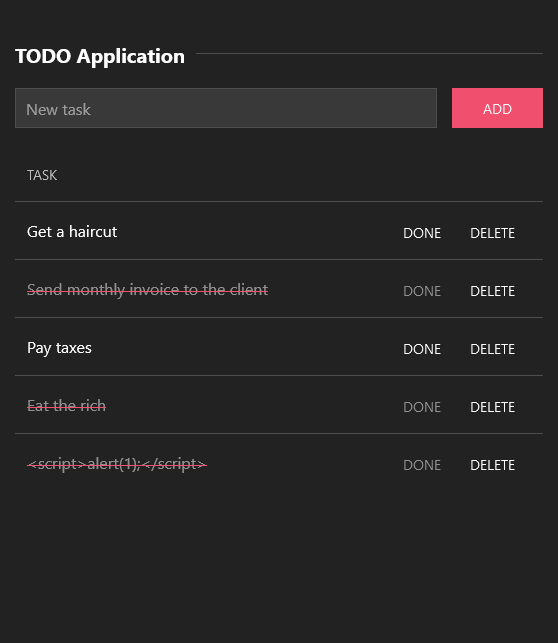

## TODO.rs

A simple TODO application in rust ( [actix](https://actix.rs/) + [diesel](https://diesel.rs/) + [tera](https://tera.netlify.app/) ).

<p align="center"></p>

### requirements:

- [docker-compose](https://docs.docker.com/compose/)
- [rust](https://www.rust-lang.org/learn/get-started)
- [diesel cli](https://github.com/diesel-rs/diesel/tree/master/diesel_cli)

```shell
$ docker-compose up -d
$ diesel migration run
$ cargo run
$ # go to http://localhost:8080
```
